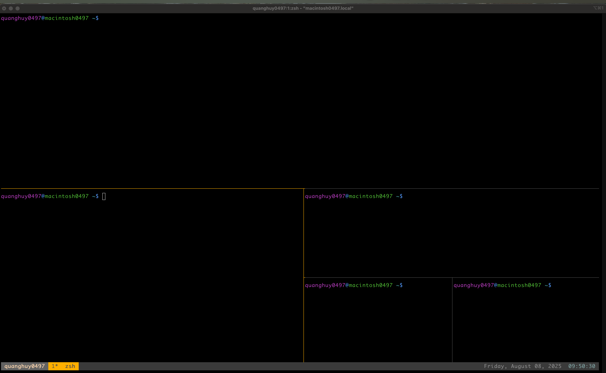

# Tmux Usage Guide

## Setup custom Tmux Config

1. Move the config file to the home directory or create a `~/.tmux.conf` with my setting on this repo:
```bash
mv tmux.conf ~/.tmux.conf
```

2. Reload the tmux config (if tmux is already running):
```bash
tmux source-file ~/.tmux.conf
```

## Basic Session Management
```bash
tmux new -s <name>           # Create a new tmux session
tmux a -t <name>             # Attach to an existing session
tmux ls                      # List all current sessions
tmux kill-session -t <name>  # Kill a session by name
```

## Panel & Window Shortcuts
(Press backtick `` ` `` as prefix key before the following)

- `` ` + h`` → Split screen horizontally
- `` ` + v`` → Split screen vertically
- `` ` + c`` → Create a new window
- `` ` + n`` → Switch to next window
- `` ` + Arrow Key`` → Move between panels
- `Ctrl + d` → Close the current panel





